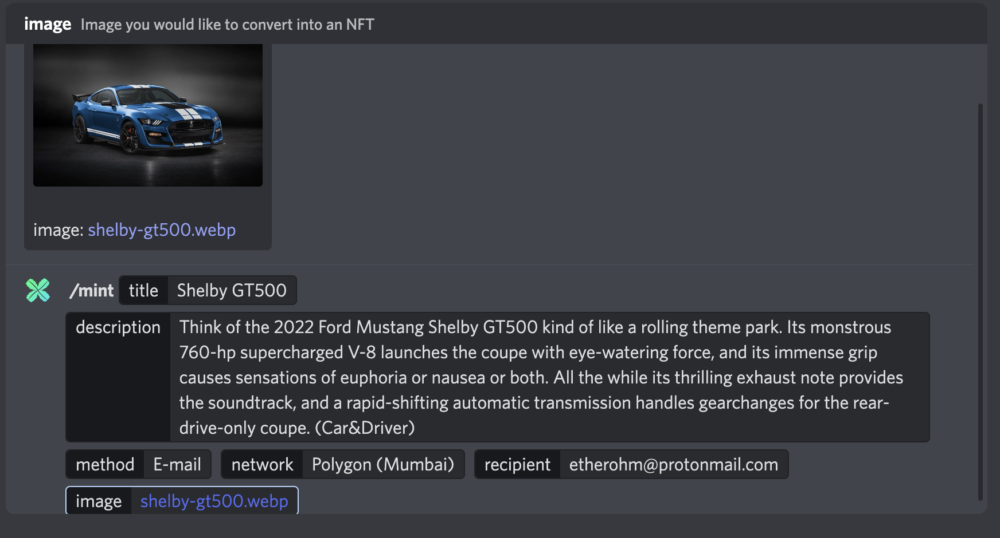
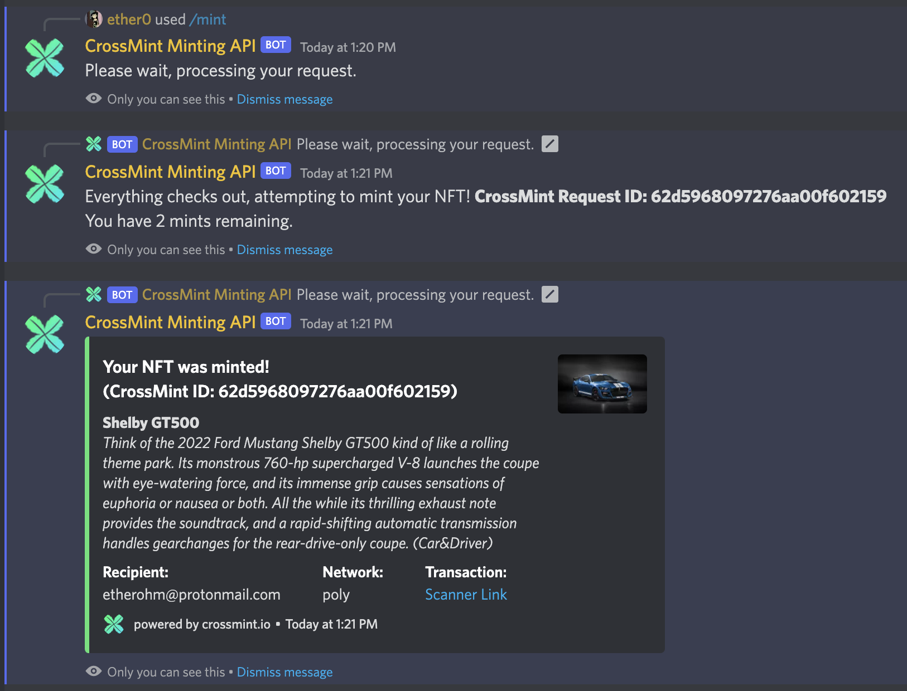
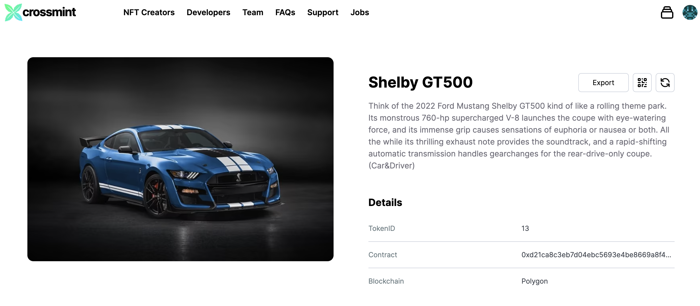
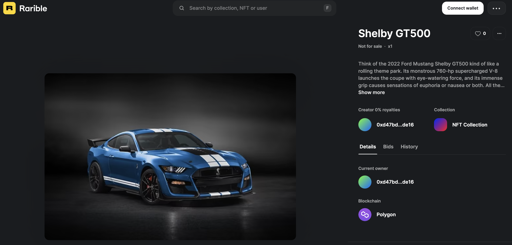

# CrossMint Minting API Bot - Discord
##### Specially crafted for [CrossMint][crossmint] 

## Licensing: Apache 2.0
https://www.apache.org/licenses/LICENSE-2.0

## Tech Stack
- NodeJS
- DiscordJS
- CrossMint Minting API

## Funtionality
This is a standalone bot that can be implemented in any server and configurable by a single file. The bot aims to make minting easy for the regular user in a fun way; straight from discord! There are some kinks such as paid networks - but free networks this can help with community interaction, have folks come just to make a mint of their dog, house, photo in spain, whatever. 

/mint `title` `description` `method` `network` `recipient` `image` 
> **Standard Paramaters:**
> title: title of the nft
> description: description of the nft
> method: gives you options such as web3 and email.
> network: select a network for your method. 
> recipient: either an address or email.
> image: the image you want to mint

## Configuration
In the main directory there is a `.env` folder. Please edit the form to reflect your own parameters. You will need to create a Discord bot on the Discord Developer console. 

Finally youll need an API key and project ID from CrossMint Console. For free mints we use staging @ polygon-mumbai.

If you are not familiar with Discord Apps, please take some time to familiarize yourself with [Discord Dev][discorddev]
If you are not familiar with CrossMint, please take some time to familiarize yourself with [CrossMint][crossmint] 

## How do we run this thing?
Clone or download the directory. On the command line, run `npm i` to install all dependancies and then `node index.js &` to run this bot. You can also leverage `pm2` as a service, this is optional. If you run into issues with module not found for node:fs, please run `npm i -D @types/node`

discord.js might throw out `Intents.FLAGS` error - if it does, please use `npm install discord.js@13.9.0`

## Example Run

But wait - did it *really* mint? 

Yes. Here is the proof: [Transaction][transaction], [OpenSea][opensea], [Rarible][rarible]

**screenshots**

## Looking forward
How can we improve this bot? What ideas can we spitball to make this better? 
- [ ] Consolidate parsing of data for recipients emails/web3 address - cleanly.
- [ ] In the server, we had a way for users to see their mints. You can implement this as well, use a DB!
- [ ] Make the configuration a database item for easy changes.
- [ ] Better feedback for the user, maybe we can email them the mint info confirmation? a DM?
- [ ] For the server, we implemented mint-limiting. It is not on the public version. Maybe we rate limit or have a mechanism to award users extra mints?
- [ ] Role-based minting privilege (must have this role to use the command)
- [ ] Maybe tier mints? If you have role 1 (10 mints) and 2 (5 mints) they combine for 15 mints?
- [ ] Kink out use case for main-net minting.
- [ ] Support creating new collections and minting to specific collections so it does not all mint to a single contract.
- [ ] Support adding custom traits to the mint (per Crossmint API)
- [ ] Maybe support bulk minting via a master `.json` file that is uploaded. The bot then interprets and executes...
- [ ] We have removed the portion for posting public mints to a channel, maybe this can be added with some customization?
- [ ] Let users DM the bot instead of slash commands?
- [ ] Some form of user control that disallows toxic users from using the system.
- [ ] Maybe implement a global monitor if used accross multiple servers?

This list can get painfully long.... I hope my basic example paves the way for greater versions of this... If any help is needed, I am more than down to help out! `#ether0#3333` on discord. Please note this code is given as-is and we are not liable for any abuse.

#### Made by ether0 via Internal crossmint Hackathon. 

   [crossmint]: <https://crossmint.io>
   [discorddev]: <https://discord.com/developers/docs/intro>
   [opensea]: <https://testnets.opensea.io/assets/mumbai/0xd21ca8c3eb7d04ebc5693e4be8669a8f40214f6c/13>
   [rarible]: <https://testnet.rarible.com/token/polygon/0xd21ca8c3eb7d04ebc5693e4be8669a8f40214f6c:13?tab=details>
   [transaction]: <https://mumbai.polygonscan.com/tx/0x991432b3d67cf07ca701e4a21a75c0a243a5705983ea9b953f7557bdcf833b7b># discord-mint-bot
